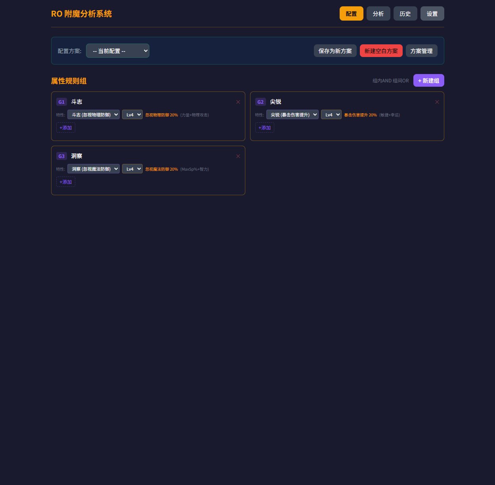
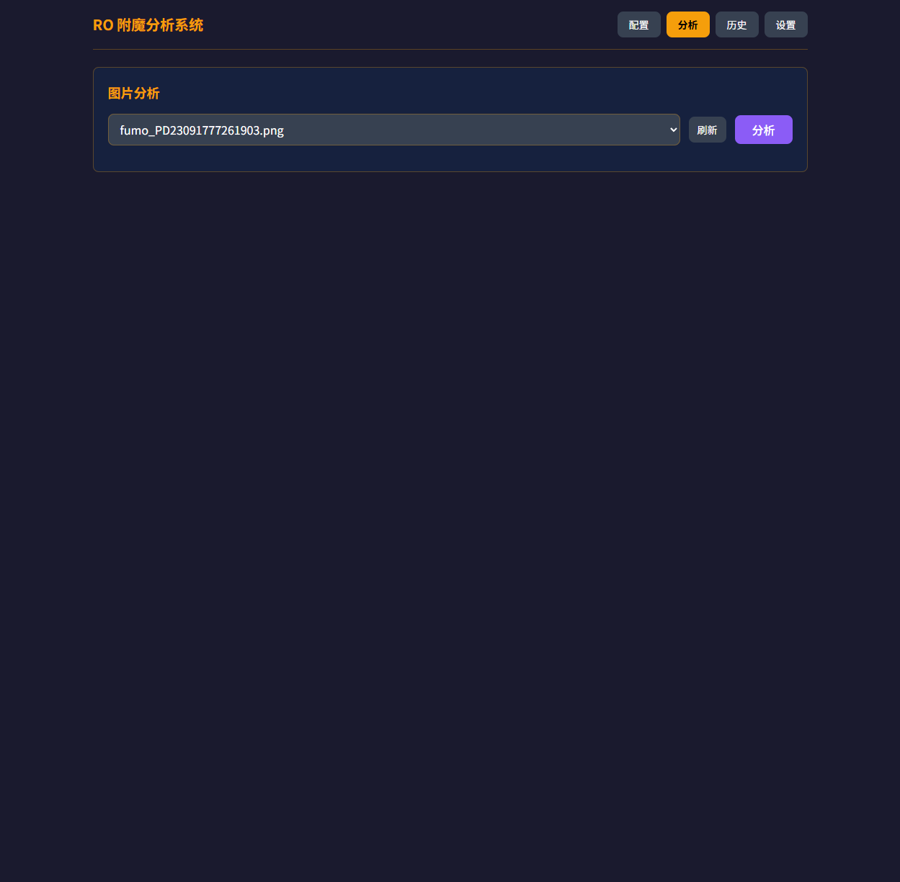
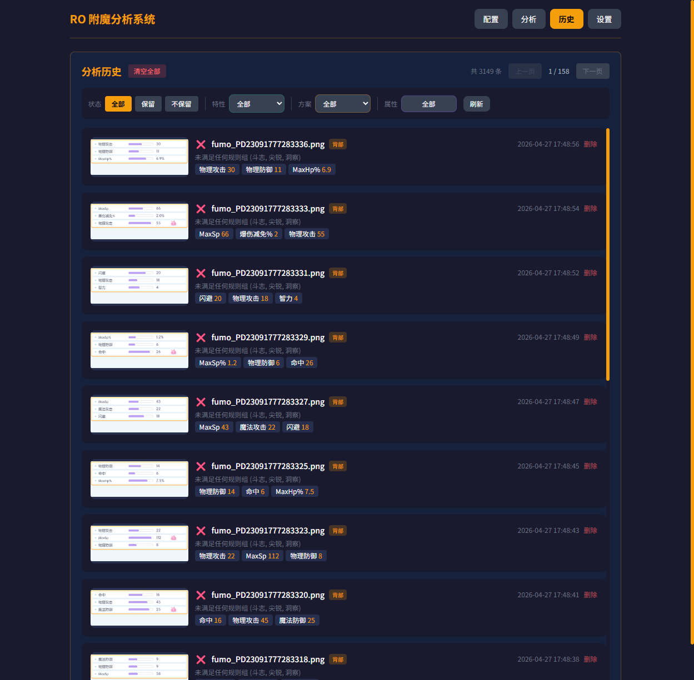
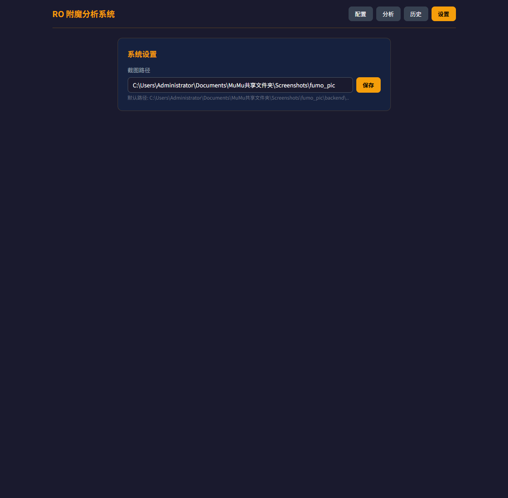

# RO 附魔分析系统

仙境传说RO（Ragnarok Online）附魔截图 OCR 识别与筛选工具。自动识别附魔属性，根据预设规则判断是否保留。

## 截图预览

<table>
  <tr>
    <td align="center"><b>规则配置</b></td>
    <td align="center"><b>OCR 分析</b></td>
  </tr>
  <tr>
    <td></td>
    <td></td>
  </tr>
  <tr>
    <td align="center"><b>分析历史</b></td>
    <td align="center"><b>系统设置</b></td>
  </tr>
  <tr>
    <td></td>
    <td></td>
  </tr>
</table>

## 功能

- **OCR 识别** — 基于 OnnxOCR (PP-OCRv5) 的附魔属性文字识别，支持双通检测（彩色+CLAHE灰度）
- **规则匹配** — 自定义规则组，每组可选组合特性+多条属性阈值，组间OR逻辑判定保留/忽略
- **配置方案** — 保存/加载规则配置快照，支持多套方案切换
- **批量分析** — 遍历截图目录，逐张识别并记录结果到SQLite
- **历史记录** — 查看分析历史，按方案筛选，支持清空

## 技术栈

| 层 | 技术 |
|---|---|
| 后端 | Python 3.10 + FastAPI + SQLite |
| OCR | OnnxOCR (PP-OCRv5 ONNX) + onnxruntime |
| 前端 | Vue 3 + Tailwind CSS（CDN SPA） |
| 包管理 | uv |

## 项目结构

```
├── backend/
│   ├── main.py              # FastAPI 入口，API 端点
│   ├── database.py          # SQLite CRUD
│   ├── ocr_engine.py        # OnnxOCR 封装，双通OCR+垃圾过滤
│   ├── matcher.py           # 规则组匹配引擎
│   ├── attribute_config.py  # 34种属性定义 + 14种组合特性
│   ├── onnxocr/             # OnnxOCR 模块（PP-OCRv5 ONNX 模型）
│   └── requirements.txt
├── frontend/
│   └── index.html           # Vue 3 SPA
├── lrscript/                # 懒人精灵 Android 自动化脚本
│   ├── 梦回初心附魔.lcprojit   # 工程配置文件
│   ├── 脚本/
│   │   └── 梦回初心附魔.lua     # 主脚本（UI配置 + 接口验证 + 附魔循环）
│   ├── 界面/
│   │   └── 梦回初心附魔.ui      # 配置界面（接口地址 + 截图路径）
│   ├── 资源/
│   │   └── 梦回初心附魔.rc      # 资源文件
│   ├── imgs/                  # 找色参考图
│   └── 插件/                   # 插件目录
├── data/                    # 运行时 SQLite 数据库
└── .venv/                   # Python 虚拟环境
```

## 快速开始

### 方式一：Python 后端服务

#### 1. 安装依赖

```bash
# 使用 uv（推荐）
uv venv .venv --python 3.10
.venv/Scripts/activate  # Windows
# source .venv/bin/activate  # Linux/Mac
uv pip install -r backend/requirements.txt
```

### 2. 启动服务

```bash
.venv/Scripts/python.exe -m uvicorn backend.main:app --host 0.0.0.0 --port 8000
```

### 3. 访问

浏览器打开 `http://localhost:8000`

### 方式二：懒人精灵 Android 脚本

将 `lrscript/` 目录下的整个工程导入懒人精灵 IDE，编译打包后运行于 Android 设备。

**配置说明**：

| 配置项 | 说明 | 默认值 |
|--------|------|--------|
| 接口服务地址 | 后端 API 地址（含端口） | `http://192.168.5.5:8000` |
| 截图保存路径 | 设备上截图存放目录 | `/mnt/sdcard/Screenshots/fumo_pic/` |

**工作流程**：
1. 启动脚本 → 弹出配置界面，填写接口地址和截图路径
2. 自动调用 `/api/schemes` 验证接口是否可用
3. 通过后进入附魔循环：截图 → 发送 OCR 识别 → 根据结果判断保留/重新附魔
4. 附魔完成或异常时自动停止

## 使用方法

1. **创建规则组** — 在规则配置页添加规则组，可选绑定组合特性（如名弓、名剑等），设置属性阈值
2. **保存方案** — 将当前规则配置保存为方案，方便后续切换
3. **分析截图** — 切换到分析页，选择附魔截图进行OCR识别，系统自动判定保留/忽略
4. **查看历史** — 在历史页查看所有分析记录，支持按方案筛选

## 匹配逻辑

- 每个规则组可指定一种组合特性+等级
- 组内判定：特性匹配 AND 所有属性规则满足
- 组间关系：任一组满足即判定为**保留**
- 无规则组时默认不保留

## 支持的属性

34种附魔属性，包括：力量/体质/灵巧/敏捷/智力/幸运（素质点）、MaxHp/MaxSp、物理/魔法攻击/防御、命中/闪避/暴击/暴击防护，以及各类百分比加成和抗性属性。

14种组合特性：名弓、名剑、名盾、名法、名服、名刺、名商、名引、名斧、名拳等。

## API 端点

| 方法 | 路径 | 说明 |
|------|------|------|
| GET/POST | `/api/rules/groups` | 规则组 CRUD |
| PUT | `/api/rules/groups/{id}/trait` | 更新规则组特性 |
| POST/DELETE | `/api/rules/groups/{id}/rules` | 组内属性规则 CRUD |
| GET/POST/DELETE | `/api/schemes` | 配置方案 CRUD |
| POST | `/api/schemes/{id}/load` | 加载方案 |
| POST | `/api/enchantment/analyze` | OCR 分析 |
| GET | `/api/history` | 分析历史 |
| GET | `/api/files` | 可用截图列表 |
| GET | `/api/attributes/definitions` | 属性定义 |
| GET | `/api/traits/definitions` | 组合特性定义 |

## License

MIT
